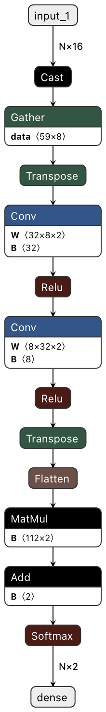

# Derand

## Text tokenization and cleanup from words that look random

```java
Derand.tokenize("hello 3y29842ysjhfs world");
// "hello <rnd> world"

Derand.clean("hello 3y29842ysjhfs world")
// "hello world
```

### How it works?

Derand uses pre-trained character level Convolutional Neural Network that operates on character embeddings.
Derand neural net has slightly over 1000 params. 
Derand performs very well on CPUs and with default params achieves sub-millisecond inference on strings.

The model of the network is in lightly optimized ONNX format that you can further optimize for your specific CPU. 

### Does it scale?
This package is being used in the logs ingestion pipeline at edge and scales to process gigabytes of data a second with a similar performance of regex.

### Is it thread-safe?
Derand uses DJL and its predictors to load ONNX model and run inference. 
Each predictor is initialized in a ThreadLocal container. 


### What are dependencies?
This package depends on [Deep Java Library](https://djl.ai/), 
DJL's PyTorch and ONNX engines wrappers. 

### How the model looks?



### What is the input to the model?
Input to the model is an array of character ids based on the character position in a pre-defined list of available chars. 


### What is output of the model?
Model outputs softmax probability of a word being random or non-random.


#### Performance optimizations
Follow DJL inference optimization guide for PyTorch and ONNX. 

Usually, having 
```shell
export OMP_NUM_THREADS=1
```
+ 
```shell
-Dai.djl.pytorch.num_interop_threads=1
-Dai.djl.pytorch.num_threads=1

```
achieves the highest throughput in a multi-threaded inference environment, such as
* Scala / Akka parallel streams
* Java parallel streams
* Java Executors


